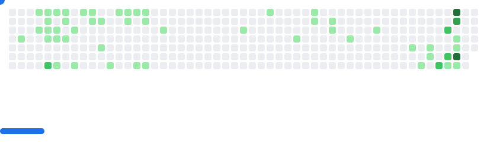

  <picture>
    <source media="(prefers-color-scheme: dark)" srcset="images/header-boot-dark.svg" />
    <source media="(prefers-color-scheme: light)" srcset="images/header-boot-light.svg" />
    
  </picture>

  <picture>
    <source media="(prefers-color-scheme: dark)" srcset="images/header-mt-dark.svg" />
    <source media="(prefers-color-scheme: light)" srcset="images/header-mt-light.svg" />
    
  </picture>

### After hours

- **[ah](https://github.com/eRgo35/ah)** — declarative package manager for
  Arch Linux · Rust
- **[ltx](https://github.com/eRgo35/ltx)** — CLI for managing LaTeX
  projects · Rust
- **[okiro](https://github.com/eRgo35/okiro)** — remote wake / shutdown ·
  Rust
- **[Server-Manager](https://github.com/eRgo35/Server-Manager)** — local
  server management · Rust

Plus the **encore** OS from
[encore-industries](https://github.com/encore-industries), the **LeafOS**
kernel in Assembly, and a self-hosted Rocky Linux + Fedora fleet with
dotfiles in [dots](https://github.com/eRgo35/dots). The other half of the
work sits in 89 private repos I never got round to opening up.

### Lately

Machine translation — a platform built on IBM Model 1 and benchmarked
against Seq2Seq and modern LLMs. Plus a granular neuro-fuzzy system.

# Michał Czyż

MEng student at the Silesian University of Technology, programmer at QNT.
Five publications in computational oncology. Everything above — built after
hours.

---

  <picture>
    <source media="(prefers-color-scheme: dark)" srcset="images/breakout-dark.svg" />
    <source media="(prefers-color-scheme: light)" srcset="images/breakout-light.svg" />
    
  </picture>

  <a href="README.pl.md">🇵🇱 po polsku</a>

