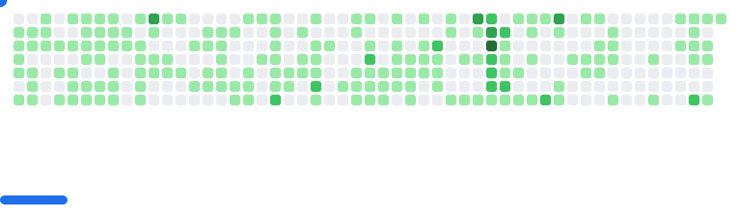

### Hi, I'm Mike 👋🏻

#### A Student and a Software Developer

I'm currently working on new fascinating projects, so be sure to follow me!

#### About Mike
-  ⚙️ I use daily: `.rs`, `.js`, `.py`, `.sh`, `.cpp`, `.md`
-  🏗️ Developed: [lyra](https://github.com/eRgo35/lyra), [ah](https://github.com/eRgo35/ah), [ti](https://github.com/eRgo35/ti), [ascii](https://github.com/eRgo35/ascii), etc...
-  🍚 Check out my: [dotfiles](https://github.com/eRgo35/dots), [nix flake](https://github.com/eRgo35/nix-config)

#### Mike around the web
-  🌎 take a look at my [website](https://c2yz.com)
-  💼 find me on [LinkedIn](https://www.linkedin.com/in/mike-czyz)
-  📹 visit my [Youtube](https://www.youtube.com/@eRgo35)

<picture>
  <source
    media="(prefers-color-scheme: dark)"
    srcset="images/breakout-dark.svg"
  />
  <source
    media="(prefers-color-scheme: light)"
    srcset="images/breakout-light.svg"
  />
  
</picture>
